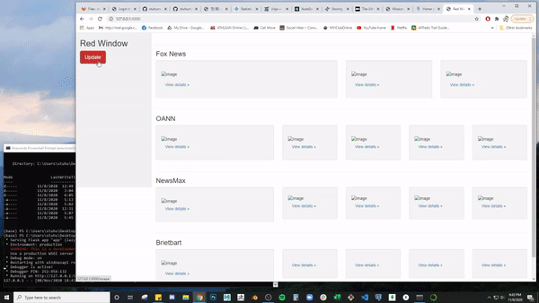

# Red Window
* Following the U.S. presidential election in 2020, it had been long anticipated by observers that the incumbent President would attempt a misinformation campaign to combat unfavorable election results.  That the incumbent would declare the election fraudulent was no surprise to those familiar with his retoric, what was less predictable were the reactions of the politicians and the right-wing news ecosystem.
* Some of the most consumed media outlets for supporters of the former President include Fox News, One America News Network, Newsmax, and Brietbart.  With the incumbent President taking a strong position on the election, how would these outlets frame the outcome of the election?  How would they frame the former President's reaction to the election results?
* Instead of searching, bookmarking, and clicking through each website, I experimented with creating a personal portal for these four select media outlets.  This was done through a python Flask application.  The top headlines from their respective websites are scraped and inserted into a MongoDB, using the 'update' button.  The Flask app takes the data from our database and populates a template page.
